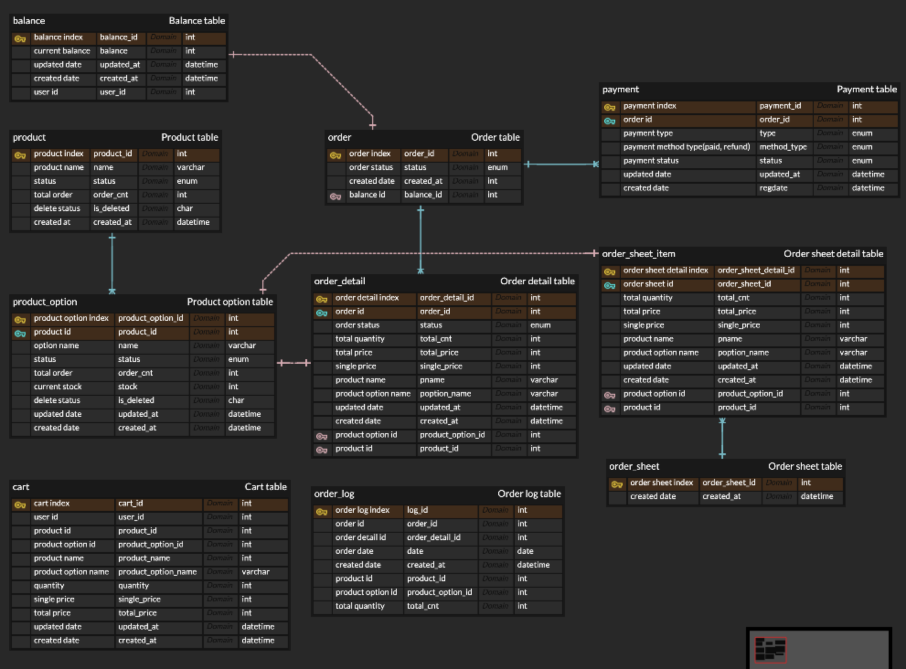

Task 5 Ecommerce Scenarios Analysis And Project Milestone

[Project Milestone](https://github.com/users/samComeIt/projects/2)

Ecommerce Scenarios Analysis (Sequence Diagram)


More sequence diagrams(Product/Order/Balance etc)
- [Get Product Information](sequenceDiagram/product/GetProductAPI.png)
- [Get Product Option Information](sequenceDiagram/product/GetProductDetailAPI.png)
- [Get Popular Product list](sequenceDiagram/product/GetProductListAPI.png)
- [Get Order Information](sequenceDiagram/order/GetOrderAPI.png)
- [Create Order](sequenceDiagram/order/PostOrderAPI02.png)
- [Create Payment](sequenceDiagram/payment/PostPaymentAPI.png)
- [Get Current Balance](sequenceDiagram/balance/GetBalanceAPI.png)
- [Patch Balance](sequenceDiagram/balance/PatchPointAPI.png)

Task 6 Database Design with Ecommerce Scenarios

Ecommerce ERD


API Specification (Swagger UI)


Week 7
Task 13
> Before understanding and applying Cache
> - Create product (@Cacheable)
> - Get product (@Cacheable)
> - Update product (Stock excluded) @CacheEvict
> - Get a list of popular products @Cacheable

> After understanding and applying Cache (Applied Termination Type of Cache)
>  - Get product (@Cacheable)
>  - Update current product stock (@CacheEvict)
>  - Get a list of popular products @Cacheable + Clear cache every 12 hours(Expiration)

> Comparison of Spring Cache and Redis Cache running time
> - Getting product data using Redis Cache (https://github.com/samComeIt/hhp03_server/commit/2128f432f7fe5f004b931def93ce2cdd478d8d8d#comments)
    >       - Running time: 2ms (Without using Redis Cache: 240ms)
> - Getting product data using Spring Cache (https://github.com/samComeIt/hhp03_server/commit/9d2ec74544315584b95e4b349f11bd25c80cb1cb#comments)
    >       - Running time : 8ms

> Summary
> - When is caching needed: Focusing on things that do not require real-time correction and running time issues
> - Getting product detail data => Eviction (Due to high probability that important data such as price will be paid with incorrect data if an existing cache exists.)
> - Getting a list of popular products => Expiration (Since orders are created in real time, there is a high probability that speed issues may occur whenever you search for popular products in real time.)
> - ex) Balance needs speed issues and real-time correction, but if caching is needed, it will be cached when checking the balance, but Eviction will be applied when updating the balance.
> - Using Caching can be helpful. (There seemed to be a big difference in query speed between applying Redis Cache and not applying it.)
>

Week 8 Task 15

> Before understanding and applying Index
> ```agsl
> CREATE INDEX idx_balance ON BALANCE(balance_id);
> CREATE INDEX idx_product ON PRODUCT(product_id);
> CREATE INDEX idx_product_option ON PRODUCT_OPTION(product_option_id);
> CREATE INDEX idx_cart ON CART02(cart_id);
> CREATE INDEX idx_order_sheet ON ORDER_SHEET(order_sheet_id);
> CREATE INDEX idx_order_sheet_item ON ORDER_SHEET_ITEM(order_sheet_item_id);
> CREATE INDEX idx_order ON "order"(order_id);
> CREATE INDEX idx_order_item ON ORDER_ITEM(order_item_id);
> CREATE INDEX idx_payment ON PAYMENT(payment_id);
> ```

> After understanding and applying Single Index (Modified)
> ```agsl
> CREATE INDEX idx_product_status ON PRODUCT(status);
> CREATE INDEX idx_product_option_status ON PRODUCT_OPTION(status);
> CREATE INDEX idx_order_status ON "order"(status);
> CREATE INDEX idx_order_updated_at ON "order"(updated_at);
> CREATE INDEX idx_order_item_status ON ORDER_ITEM(status);
> CREATE INDEX idx_payment_status ON PAYMENT(status);
> ```

> After understanding and applying Composite Index (Modified)
> ````
> CREATE INDEX idx_product_status ON PRODUCT(status);
> CREATE INDEX idx_product_option_status ON PRODUCT_OPTION(status);
> CREATE INDEX idx_order_status ON "order"(order_id, status);
> CREATE INDEX idx_order_updated_at ON "order"(updated_at);
> CREATE INDEX idx_order_item_status ON ORDER_ITEM(status);
> CREATE INDEX idx_payment_status ON PAYMENT(payment_id, status);
> ````

> Improved query by adding indexing
> - Get popular product list
> ```
> // Original
> @Query(value = "SELECT od.product " +
>       "FROM OrderDetail od" +
>       "JOIN od.order o" +
>       "WHERE o.createdAt BETWEEN :startDate AND :endDate " +
>       "GROUP BY od.pid" +
>       "ORDER BY SUM(od.totalCnt) DESC", nativeQuery = true)
> List<Product> findTopSoldProduct(@Param("startDate") LocalDate startDate, @Param("endDate") LocalDate endDate);
> 
> // Improvement (Modification)
> @Query(value = "SELECT od.product " +
>       "FROM OrderDetail od" +
>       "JOIN od.order o" +
>       "WHERE o.createdAt BETWEEN :startDate AND :endDate " +
>       "AND o.status = 1" +
>       "GROUP BY od.pid" +
>       "ORDER BY SUM(od.totalCnt) DESC", nativeQuery = true)
> List<Product> findTopSoldProduct(@Param("startDate") LocalDate startDate, @Param("endDate") LocalDate endDate);
> ```
> 
> - Get order information
> ```
> // Original
> Optional<Order> findById(Long orderId);
> 
> // Improvement (Modification)
> @Query("SELECT o FROM Order o WHERE o.orderId = :orderId AND o.status = :status")
> Optional<Order> findByOrderIdAndStatus(Long orderId, OrderStatus status);
> ```
> 
> - Get payment infomration
> 
> ```agsl
> // Original
> Optional<Payment> findById(Long paymentId);
>
> // Improvement (Modification)
> @Query("SELECT p FROM Payment p WHERE p.paymentId = :paymentId AND p.status = :status")
> Optional<Payment> findByPaymentIdAndStatus(@Param("paymentId") Long paymentId, @Param("status") PaymentStatus status);
> ```

> EXPLAIN Result
> - Single Index
> 
> 
> - Composite Index Included
> 

> Summary(Single Index vs Composite Index)
> - When processing an order, order and payment data are created and status are updates. An improvement can be made by checking whether the payment is in a waiting status before the status is updated.
> - Getting order information and a list of popular products, it is appropriate to apply it as a composite index because it is collected based on order deposit completion (status) and deposit date (updated_at).
> - Balance inquiry, balance_id PK 
> - When getting data on product & product_option, order_sheet & order_sheet_item, order & order_item, change query to SQL JOINS
> and change product_option, order_sheet_item, order_item columns to composite index.
>   - ````
>     CREATE INDEX idx_product_option ON PRODUCT_OPTION(product_id, product_option_id);
>     CREATE INDEX idx_order_sheet_item ON ORDER_SHEET_ITEM(order_sheet_id, order_sheet_item_id);
>     CREATE INDEX idx_order_item ON ORDER_ITEM(order_id, order_item_id);
>     ````
> - Composite index is applied when searching for orders, but there is a possibility of adding a single index through further development in the future.
>   - ex) Getting a list of order with search filter from the admin
> 
> 
> - order_item -> complete_date(payment completed date), refund_apply_date(applied refund date), refund_date(refund completed date),
> return_apply(return applied date), return_date(return completed date), exchange_apply_date(exchange applied date), exchange_date(exchanged date) etc... additional columns apply single index
>   - Create ORDER_ITEM_STATUS_LOG table and add composite index due to a lot of index ->
>   CREATE INDEX idx_order_status_log ON ORDER_ITEM_STATUS_LOG (order_id, order_item_id, status, created_at)
>