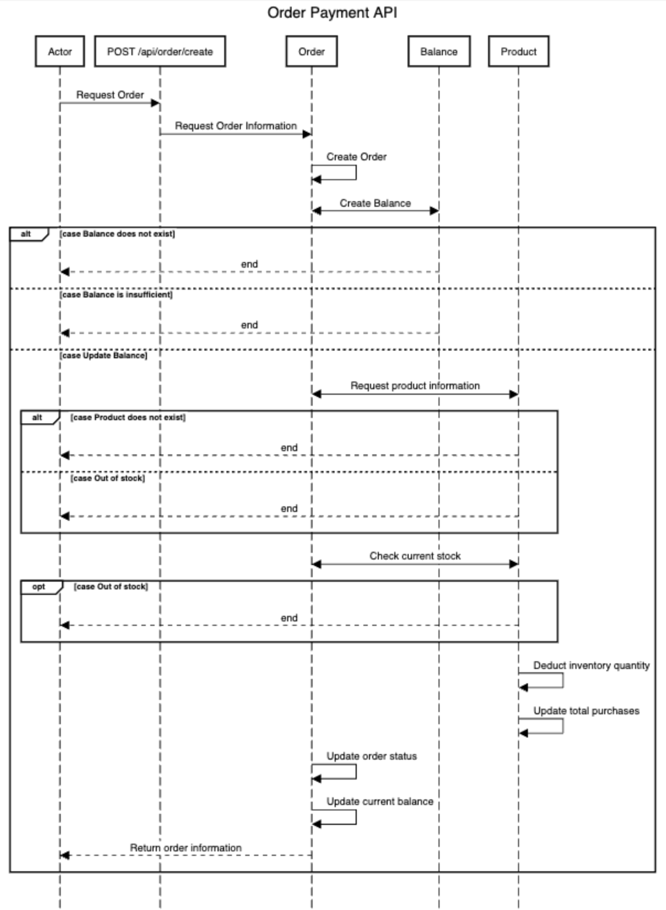

Task 5 시나리오 분석 및 작업 계획

[프로젝트 Milestone](https://github.com/users/samComeIt/projects/2)

시나리오 요구사항 분석 자료(시퀀스 다이어그램)

시퀀스 다이어그램 더 보기(상품/주문/잔액 조회 등)
- [상품 조회](sequenceDiagram/product/GetProductAPI.png)
- [상품 상세 조회](sequenceDiagram/product/GetProductDetailAPI.png)
- [상위 상품 목록 조회](sequenceDiagram/product/GetProductListAPI.png)
- [주문 조회](sequenceDiagram/order/GetOrderAPI.png)
- [주문 결제](sequenceDiagram/order/PostOrderAPI.png)
- [잔액 조회](sequenceDiagram/balance/GetBalanceAPI.png)
- [잔액 충전](sequenceDiagram/balance/PatchPointAPI.png)

Taks 6 시나리오 설계 자료 제출

이커머스 ERD

API 명세
