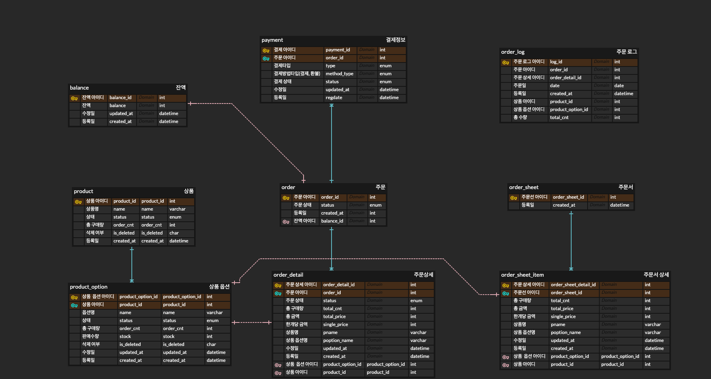

Week 8 Task 15

> Index 이해X 및 적용전
> ```agsl
> CREATE INDEX idx_balance ON BALANCE(balance_id);
> CREATE INDEX idx_product ON PRODUCT(product_id);
> CREATE INDEX idx_product_option ON PRODUCT_OPTION(product_option_id);
> CREATE INDEX idx_cart ON CART02(cart_id);
> CREATE INDEX idx_order_sheet ON ORDER_SHEET(order_sheet_id);
> CREATE INDEX idx_order_sheet_item ON ORDER_SHEET_ITEM(order_sheet_item_id);
> CREATE INDEX idx_order ON "order"(order_id);
> CREATE INDEX idx_order_item ON ORDER_ITEM(order_item_id);
> CREATE INDEX idx_payment ON PAYMENT(payment_id);
> ```

> 단일 Index 이해 및 적용(개선) 후
> ```agsl
> CREATE INDEX idx_product_status ON PRODUCT(status);
> CREATE INDEX idx_product_option_status ON PRODUCT_OPTION(status);
> CREATE INDEX idx_order_status ON "order"(status);
> CREATE INDEX idx_order_updated_at ON "order"(updated_at);
> CREATE INDEX idx_order_item_status ON ORDER_ITEM(status);
> CREATE INDEX idx_payment_status ON PAYMENT(status);
> ```

> 복합 Index 이해 및 적용(개선) 후
> ````
> CREATE INDEX idx_product_status ON PRODUCT(status);
> CREATE INDEX idx_product_option_status ON PRODUCT_OPTION(status);
> CREATE INDEX idx_order_status ON "order"(order_id, status);
> CREATE INDEX idx_order_updated_at ON "order"(updated_at);
> CREATE INDEX idx_order_item_status ON ORDER_ITEM(status);
> CREATE INDEX idx_payment_status ON PAYMENT(payment_id, status);
> ````

> 인덱스 통해서 Query 개선
> - 인기 상품 조회
> ```
> // 기존
> @Query(value = "SELECT od.product " +
>       "FROM OrderDetail od" +
>       "JOIN od.order o" +
>       "WHERE o.createdAt BETWEEN :startDate AND :endDate " +
>       "GROUP BY od.pid" +
>       "ORDER BY SUM(od.totalCnt) DESC", nativeQuery = true)
> List<Product> findTopSoldProduct(@Param("startDate") LocalDate startDate, @Param("endDate") LocalDate endDate);
> 
> // 개선(수정)
> @Query(value = "SELECT od.product " +
>       "FROM OrderDetail od" +
>       "JOIN od.order o" +
>       "WHERE o.createdAt BETWEEN :startDate AND :endDate " +
>       "AND o.status = 1" +
>       "GROUP BY od.pid" +
>       "ORDER BY SUM(od.totalCnt) DESC", nativeQuery = true)
> List<Product> findTopSoldProduct(@Param("startDate") LocalDate startDate, @Param("endDate") LocalDate endDate);
> ```
> 
> - 주문(Order) 조회
> ```
> // 기존
> Optional<Order> findById(Long orderId);
> 
> // 개선(추가)
> @Query("SELECT o FROM Order o WHERE o.orderId = :orderId AND o.status = :status")
> Optional<Order> findByOrderIdAndStatus(Long orderId, OrderStatus status);
> ```
> 
> - 결제(Payment) 조회
> 
> ```agsl
> // 기존
> Optional<Payment> findById(Long paymentId);
>
> // 개선(추가)
> @Query("SELECT p FROM Payment p WHERE p.paymentId = :paymentId AND p.status = :status")
> Optional<Payment> findByPaymentIdAndStatus(@Param("paymentId") Long paymentId, @Param("status") PaymentStatus status);
> ```

> EXPLAIN 결과
> - 단일 인덱스
> 
> 
> - 복합 인덱스 포함
> 

> 결론(단일 인덱스 vs 복합 인덱스)
> - 현재 주문처리 할때 주문서(order)와 결제서(payment) 데이터 생성하고 상태 업데이트 처리하므로 상태 업데이트 전에 입금완료 상태 전에 입금대기 상태인것을 조회하는 것으로 개선이 된다고 판단됩니다. 
> - 조회주문 조회 및 인기 상품 조회 같은 경우 주문 입금완료(status)와 입금일(updated_at) 기준으로 수집하므로 복합 인덱스로 적용하는게 적절하다고 판단이 됩니다.
> - 잔액 조회 같은 경우 balance_id PK 
> - product & product_option, order_sheet & order_sheet_item, order & order_item 데이터 조회를 SQL JOINS 로 변경하면 
> product_option, order_sheet_item, order_item 복합 인덱스를 변경 할 것 같습니다.
>   - ````
>     CREATE INDEX idx_product_option ON PRODUCT_OPTION(product_id, product_option_id);
>     CREATE INDEX idx_order_sheet_item ON ORDER_SHEET_ITEM(order_sheet_id, order_sheet_item_id);
>     CREATE INDEX idx_order_item ON ORDER_ITEM(order_id, order_item_id);
>     ````
> - 현재 주문 조회 할때 복합 인덱스로 적용을 했지만 미래에 추가 개발을 하면 단일 인텍스 추가 할 가능성이 보입니다.
>   - 예시) 관리자에서 주문 리스트 조회 및 검색 필터
> 
> 
> - order_item -> complete_date(입금일), refund_apply_date(환불신청일), refund_date(환불일),
> return_apply(반품신청일), return_date(반품일), exchange_apply_date(교환신청일), exchange_date(교환일) 등 컬럼 추가 단인 인덱스 적용
>   - 하지만 너무 많은 인덱스이므로 ORDER_ITEM_STATUS_LOG 테이블을 생성하고
>   CREATE INDEX idx_order_status_log ON ORDER_ITEM_STATUS_LOG (order_id, order_item_id, status, created_at) 복합 인덱스 추가 할 것 같습니다.
>

Week 7
Task 13 
> 캐시 이해X 및 적용 전
> - product 등록 (@Cacheable)
> - product 조회 (@Cacheable)
> - product 수정(재고제외) @CacheEvict
> - 인기상품 조회 @Cacheable

> 캐시 이해 및 적용(개선) 후 (Cache  의 Termination Type 추가 적용)
>  - product 조회 (@Cacheable)
>  - product 현재 재고 수정 (@CacheEvict)
>  - 인기상품 조회 @Cacheable + 12시간 마다 캐시 삭제 처리(Expiration)

> Spring Cache 와 Redis Cache 소유 시간 비교
> - 레디스 캐싱 상품 조회 테스트 (https://github.com/samComeIt/hhp03_server/commit/2128f432f7fe5f004b931def93ce2cdd478d8d8d#comments)
>       - 소유 시간: 2ms (레디스 캐시 미적용: 240ms)
> - 스프링 캐싱 상품 조회 테스트 (https://github.com/samComeIt/hhp03_server/commit/9d2ec74544315584b95e4b349f11bd25c80cb1cb#comments)
>       - 소유 시간 : 8ms

> 결론
> - 캐싱 적용 대상: 속도 이슈 및 실시간성 보정이 필요없는 것 중심
> - 상품 상세 정보 조회 => Eviction (가격 같은 중요한 데이터가 기존캐시가 존재시 안 맞는 데이터로 결제 될 확률이 높기 떄문입니다)
> - 인기 상품 조회 => Expiration (실시간으로 주문이 생성하므로 실시간으로 인기 상품 조회 할때마다 속도 이슈가 생길 수 있는 확률이 높습니다) 
> - 예) Balance는 속도 이슈 및 실시간성 보정이 필요하지만 캐싱 적용이 필요하면,
> 잔액 조회시 캐싱해주지만 잔액 업데이트시 Eviction으로 적용을 할 것
> - 캐싱처리 해줘도 도움이 된다 (특히, Redis Cache 적용하는거랑 안하는거에 대한 조회 속도 차이가 큰 것으로 보였습니다.)
> 

Task 5 시나리오 분석 및 작업 계획

[프로젝트 Milestone](https://github.com/users/samComeIt/projects/2)

시나리오 요구사항 분석 자료(시퀀스 다이어그램)


시퀀스 다이어그램 더 보기(상품/주문/잔액 조회 등)
- [상품 조회](sequenceDiagram/product/GetProductAPI.png)
- [상품 상세 조회](sequenceDiagram/product/GetProductDetailAPI.png)
- [상위 상품 목록 조회](sequenceDiagram/product/GetProductListAPI.png)
- [주문 조회](sequenceDiagram/order/GetOrderAPI.png)
- [주문 생성](sequenceDiagram/order/PostOrderAPI02.png)
- [결제 생성](sequenceDiagram/payment/PostPaymentAPI.png)
- [잔액 조회](sequenceDiagram/balance/GetBalanceAPI.png)
- [잔액 충전](sequenceDiagram/balance/PatchPointAPI.png)

Taks 6 시나리오 설계 자료 제출

이커머스 ERD


API 명세


Swagger UI

