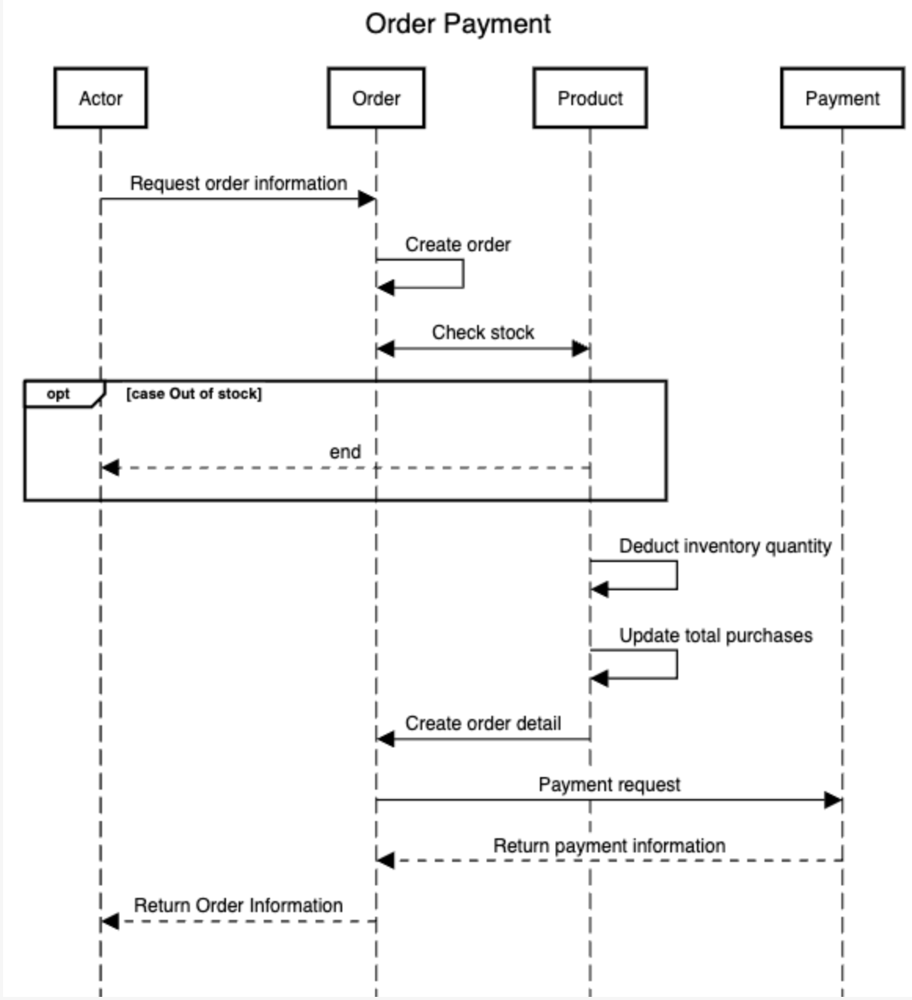
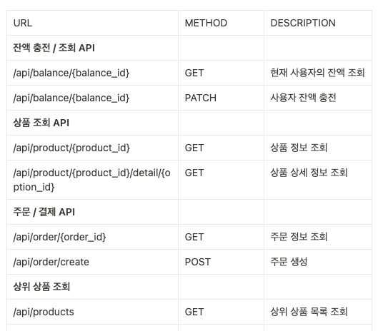

Task 11 & 12

낙관적 락(Optimisstic Lock) 적용 시도

단위 테스트
- BalanceOptimisticLockTest (633ms)
  

- ProductOptimisticLockTest (573ms)
  

통합 테스트
- OrderFacadeOptimisticLockTest (140ms)
  

테스트 통해서 낙관적 락와 비관전 락 중에 선택을 해야된다면 상황에 따라 다를것 같습니다. 
1) 한 회원의 정보를 몇번(little) 조회 및 차감/충전 비관적 락으로 적용
2) 빅세일 통해서 수 많은 접속 및 생성(주문 생성, 상품 재고 차감 및 회원 잔액 업데이트 등)으로 낙관적 락 적용

잔액 충전 테스트(20번) 와 상품 재고 차감 테스트(10번) 시간을 비교를 하면 잔액 충전 테스트에서 낙관적 락이 비관적 락 보다 빨랐습니다.
-> 많을 수록 낙관적 락이 유리

[비관적 락 PR](https://github.com/samComeIt/hhp03_server/pull/29)

[Redis s-lock PR](https://github.com/samComeIt/hhp03_server/pull/28)

----------------

Task 5 시나리오 분석 및 작업 계획

[프로젝트 Milestone](https://github.com/users/samComeIt/projects/2)

시나리오 요구사항 분석 자료(시퀀스 다이어그램)

시퀀스 다이어그램 더 보기(상품/주문/잔액 조회 등)
- [상품 조회](sequenceDiagram/product/GetProductAPI.png)
- [상품 상세 조회](sequenceDiagram/product/GetProductDetailAPI.png)
- [상위 상품 목록 조회](sequenceDiagram/product/GetProductListAPI.png)
- [주문 조회](sequenceDiagram/order/GetOrderAPI.png)
- [주문 생성](sequenceDiagram/order/PostOrderAPI02.png)
- [결제 생성](sequenceDiagram/payment/PostPaymentAPI.png)
- [잔액 조회](sequenceDiagram/balance/GetBalanceAPI.png)
- [잔액 충전](sequenceDiagram/balance/PatchPointAPI.png)

Taks 6 시나리오 설계 자료 제출

이커머스 ERD

API 명세

Swagger UI

